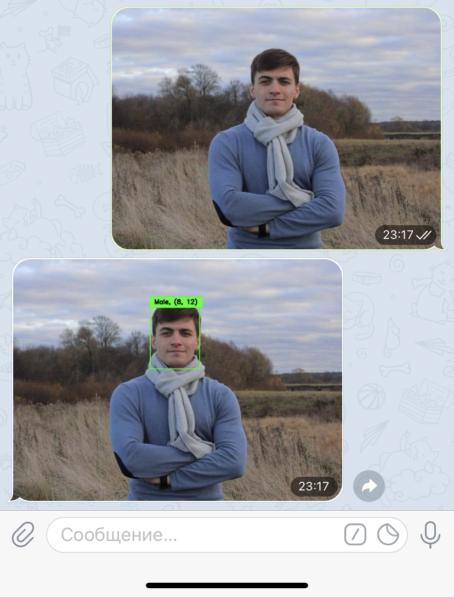
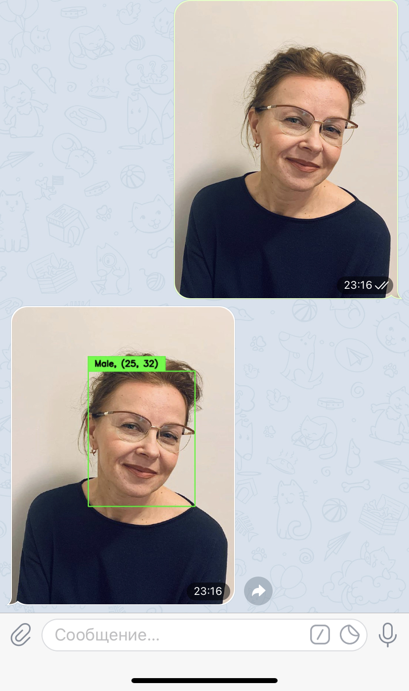

# X5School Python Project - fphydsbot

This is a python package for telegram bot ```@fphydsbot``` which can detect human's faces, determine genders and ages by photo. All you need is just send your photo to bot and wait for the result.

## Examples



## How to install

```bash
python3 setup.py install
```

## How to run the bot

```python
# simple usage
import fphydsbot

TOKEN = 'YOUR TOKEN'
fphydsbot.model.download()
bot = fphydsbot.bot.Bot(TOKEN)
bot.run()
```

## Package structure

Models for detection and predicting genders and ages are stored at ```fphydsbot/model/_model.py```. There is a script for downloading model's weights and CNN architectures, stored at ```fphydsbot/model/_download.py```, they will be stored at ```fphydsbot/model/models``` after downloading.

Bot interface are stored at ```fphydsbot/bot/_bot.py```.


